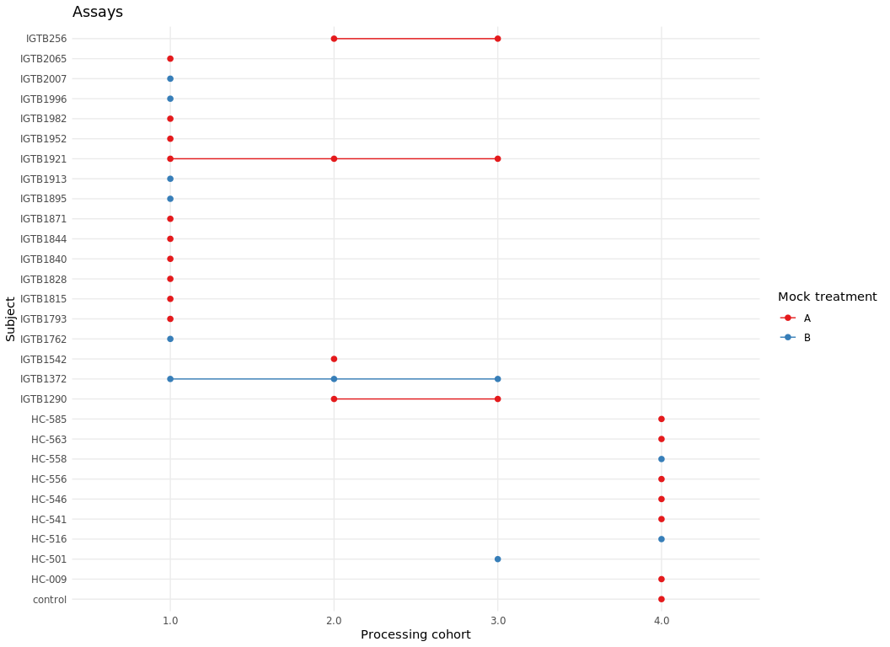

Normalization methods
================

``` r
knitr::opts_chunk$set( message = FALSE, warning = FALSE, fig.height=8, fig.width=11)
library(tidyverse)
library(BiocManager)
library(scuttle)
library(scater)
library(uwot)
library(edgeR)
library(ruv)
library(Seurat)
library(swapper)
library(cluster)
library(factoextra)
library(UpSetR)

source("/mnt/auxf.R")
path <- ('/domino/datasets/local/RUV')
```

## Preprocessing

### Pseudobulk matrices

``` r
ds <- readRDS("/domino/datasets/local/RUV/sclupusds2cor.rds")
PBC <- readRDS("/domino/datasets/local/RUV/pblupusds2.rds")
PBPSC  <- readRDS("/domino/datasets/local/RUV/pbps10rep_ds2.rds")

hkGagnon <- read.csv(paste0(path,"/Genes_Gagnon.txt"), sep="")
```

### Negative control genes and high variable genes

``` r
hkGagnon <- unlist(hkGagnon)
filter.vst <- FindVariableFeatures(PBC,selection.method = 'vst')
top_high_varg <- rownames(arrange(filter.vst,-vst.variance.standardized))[1:500]
top_high_regvarg<-rownames(arrange(filter.vst,-vst.variance))[1:500]
high_varg <- which(filter.vst[hkGagnon,]$vst.variance.standardized>1.8)

gene.D <- data.frame(gene=rownames(PBC))
rownames(gene.D) <- gene.D$gene
hk.ind <- rownames(PBC) %in% hkGagnon[-high_varg]
```

### Assigning mock treatment

``` r
subs <- unique(PBC$samples$ind_cov)
set.seed(1)
treatment <- sample(c("A","B"),length(subs), replace=T)

PBC$samples <- PBC$samples %>% left_join(bind_cols(ind_cov = subs, fk.tr = treatment), by='ind_cov')
```

## Dataset

``` r
celltypes <- levels(PBC$samples$cg_cov)

group_by(PBC$samples,Processing_Cohort,ind_cov,pop_cov,Age,fk.tr) %>%
  summarise(count=n()) %>% ungroup()%>% 
  mutate(ind_cov=str_extract(as.character(ind_cov),"[^_]+$")) %>%
  ggplot(aes(y=ind_cov,x=Processing_Cohort, group=ind_cov, color=fk.tr)) +
  geom_point(size=2) + geom_line() + scale_colour_brewer(palette='Set1') +
  labs(y = "Subject", x= "Processing cohort", color = "Mock treatment")+ theme_minimal()+
  ggtitle('Assays')
```

<!-- -->

## Unwanted variation in the data

### Code

``` r
ys.ct <- lapply(celltypes,split.ct,PBC=PBC)

logys.ct <- lapply(ys.ct,edgeR::cpm,log=T)
  
pcas <- lapply(logys.ct, calculatePCA, ncomponents=10)

pcos <- lapply(ys.ct, function (x) as.integer(x$samples$Processing_Cohort))
sil2s <- mapply(silhouette,x=pcos,dist=lapply(pcas,function(x) dist(x[,1:2],"euclidean") ), SIMPLIFY = F)
silps <- mapply(silhouette,x=pcos,dist=lapply(pcas,dist, "manhattan") ,SIMPLIFY = F)

avgs_sw2 <- lapply(sil2s, function (x) round(mean(x[,3]),2))
avgs_swp <- lapply(silps, function (x) round(mean(x[,3]),2))
  
ordnames <- lapply(ys.ct, function (x) arrange(x$samples,Processing_Cohort)$'sample_cell') 

Silplots <- lapply(silps,Silplot)

PCAplots <- mapply(PCAplot, pca= pcas, y=ys.ct, SIMPLIFY = F)

RLEplots <- mapply(RLEplot, names= ordnames, logy=logys.ct,samples=map(ys.ct, "samples"), SIMPLIFY = F)

Hists <- lapply(ys.ct,histpvals)
```

``` r
for (i in 1:length(celltypes)){
  
  cat(knitr::knit_expand(text=paste0('\n### ',celltypes[i], ' {-}\n')))
  
  plots <- list(Silplots[[i]], PCAplots[[i]], RLEplots[[i]], Hists[[i]])
 
  print(ggpubr::ggarrange(plotlist=plots,nrow=2,ncol=2, common.legend = T, legend="bottom"))

  cat(knitr::knit_expand(text=paste0("\n\n")))

}
```

### B

<!-- -->

### NK

<!-- -->

### T4

<!-- -->

### T8

<!-- -->

### cDC

<!-- -->

### cM

<!-- -->

### ncM

<!-- -->

### pDC

<!-- -->

## Removing the Processing Cohort effect

### Code

``` r
normpc <- function(y){
  logy <- edgeR::cpm(y,log=T)
  design <- model.matrix(~ #y$samples$fk.tr +
                           y$samples$Processing_Cohort ) 
  colnames(design) <- c('(Intercept)',#'tr',
                        paste0('Proc', 2:4))
  v <- voom(y, design, plot=F) 
  vfit <- lmFit(v, design)
  alpha <- vfit$coefficients[,paste0('Proc', 2:4)] # same coefficients as efit and returned by toptable
  newY <- logy - t(design[,paste0('Proc', 2:4)]%*%t(alpha))
  return(newY)
}

histpc <- function(y){
  logy <- edgeR::cpm(y,log=T)
  design <- model.matrix(~ y$samples$fk.tr + y$samples$Processing_Cohort ) 
  colnames(design) <- c('(Intercept)','tr',paste0('Proc', 2:4))
  v <- voom(y, design, plot=F) 
  vfit <- lmFit(v, design)
  efit <- eBayes(vfit)
  pvalspc <- topTable(efit, coef=2, number=dim(y)[1], adjust="BH")
  
  ggplot(pvalspc, aes(x=P.Value)) + geom_histogram(bins=15) + scale_color_brewer(palette='Set1') + ggtitle("P-values histogram") + theme_minimal()
 
}

normpcs.ct <- lapply(ys.ct,normpc)
pcas <- lapply(normpcs.ct, calculatePCA, ncomponents=10)
pcos <- lapply(ys.ct, function (x) as.integer(x$samples$Processing_Cohort))

sil2s <- mapply(silhouette,x=pcos,dist=lapply(pcas,function(x) dist(x[,1:2],"euclidean") ), SIMPLIFY = F)
silps <- mapply(silhouette,x=pcos,dist=lapply(pcas,dist, "manhattan") ,SIMPLIFY = F)

avgs_sw2 <- lapply(sil2s, function (x) round(mean(x[,3]),2))
avgs_swp <- lapply(silps, function (x) round(mean(x[,3]),2))
  
ordnames <- lapply(ys.ct, function (x) arrange(x$samples,Processing_Cohort)$'sample_cell') 

Silplots <- lapply(silps,Silplot)

PCAplots <- mapply(PCAplot, pca= pcas, y=ys.ct, SIMPLIFY = F)

RLEplots <- mapply(RLEplot, names= ordnames, logy=normpcs.ct, samples=map(ys.ct, "samples"), SIMPLIFY = F)

Hists <- lapply(ys.ct,histpc)
```

``` r
for (i in 1:length(celltypes)){
  
  cat(knitr::knit_expand(text=paste0('\n### ',celltypes[i], ' {-}\n')))
  
  plots <- list(Silplots[[i]], PCAplots[[i]], RLEplots[[i]], Hists[[i]])
 
  print(ggpubr::ggarrange(plotlist=plots,nrow=2,ncol=2, common.legend = T, legend="bottom"))

  cat(knitr::knit_expand(text=paste0("\n\n")))

}
```

### B

<!-- -->

### NK

<!-- -->

### T4

<!-- -->

### T8

<!-- -->

### cDC

<!-- -->

### cM

<!-- -->

### ncM

<!-- -->

### pDC

<!-- -->

## RUV methods

### RUV2

#### Code

``` r
k=5

ruv2T2 <- mapply(RUV2mod, Y = lapply(logys.ct,t), X = map(ys.ct,\(x) x$samples$fk.tr), ctl =  lapply(ys.ct, function (x) rownames(x) %in% hkGagnon[-high_varg]), k= as.list(rep(k,length(celltypes))), SIMPLIFY=F)

normT2 <- lapply(ruv2T2,function (x) t(x$newY))

pcas <- lapply(normT2, calculatePCA, ncomponents=10)
pcos <- lapply(ys.ct, function (x) as.integer(x$samples$Processing_Cohort))

sil2s <- mapply(silhouette,x=pcos,dist=lapply(pcas,function(x) dist(x[,1:2],"euclidean") ), SIMPLIFY = F)
silps <- mapply(silhouette,x=pcos,dist=lapply(pcas,dist, "manhattan") ,SIMPLIFY = F)

avgs_sw2 <- lapply(sil2s, function (x) round(mean(x[,3]),2))
avgs_swp <- lapply(silps, function (x) round(mean(x[,3]),2))

ordnames <- lapply(ys.ct, function (x) arrange(x$samples,Processing_Cohort)$'sample_cell') 

SilplotsT22 <- lapply(silps,Silplot)

PCAplotsT22 <- mapply(PCAplot, pca= pcas, y=ys.ct, SIMPLIFY = F)

RLEplotsT22 <- mapply(RLEplot, names= ordnames, logy=normT2,samples= map(ys.ct,'samples'), SIMPLIFY = F)


HistsT22 <- mapply(histT,y=ys.ct,w=map(ruv2T2,"W"),map(ys.ct,'samples'),SIMPLIFY = F)
```

``` r
for (i in 1:length(celltypes)){
  
  cat(knitr::knit_expand(text=paste0('\n#### ',celltypes[i], ' {-}\n')))
  
  plots <- list(SilplotsT22[[i]], PCAplotsT22[[i]], RLEplotsT22[[i]], HistsT22[[i]])
 
  print(ggpubr::ggarrange(plotlist=plots,nrow=2,ncol=2, common.legend = T, legend="bottom"))

  cat(knitr::knit_expand(text=paste0("\n\n")))

}
```

#### B

<!-- -->

#### NK

<!-- -->

#### T4

<!-- -->

#### T8

<!-- -->

#### cDC

<!-- -->

#### cM

<!-- -->

#### ncM

<!-- -->

#### pDC

<!-- -->

### RUVIII

#### Code

``` r
Mcts.ct <- lapply (ys.ct, function(x){
  Mct <- replicate.matrix(x$samples$ind_cov)
  rownames(Mct) <- x$samples$ind_cov
  Mct
})

ruv3T2 <- mapply(RUVIIIW, Y = lapply(logys.ct,t), M=Mcts.ct , ctl =  lapply(ys.ct, function (x) rownames(x) %in% hkGagnon[-high_varg]), k= as.list(rep(k,length(celltypes))), return.info=as.list(rep(T,length(celltypes))), SIMPLIFY=F)

normT2 <- lapply(ruv3T2,function (x) t(x$newY))

pcas <- lapply(normT2, calculatePCA, ncomponents=10)
pcos <- lapply(ys.ct, function (x) as.integer(x$samples$Processing_Cohort))

sil2s <- mapply(silhouette,x=pcos,dist=lapply(pcas,function(x) dist(x[,1:2],"euclidean") ), SIMPLIFY = F)
silps <- mapply(silhouette,x=pcos,dist=lapply(pcas,dist, "manhattan") ,SIMPLIFY = F)

avgs_sw2 <- lapply(sil2s, function (x) round(mean(x[,3]),2))
avgs_swp <- lapply(silps, function (x) round(mean(x[,3]),2))

ordnames <- lapply(ys.ct, function (x) arrange(x$samples,Processing_Cohort)$'sample_cell') 

SilplotsT23 <- lapply(silps,Silplot)

PCAplotsT23 <- mapply(PCAplot, pca= pcas, y=ys.ct, SIMPLIFY = F)

RLEplotsT23 <- mapply(RLEplot, names= ordnames, logy=normT2,samples= map(ys.ct,'samples'), SIMPLIFY = F)


HistsT23 <- mapply(histT,y=ys.ct,w=map(ruv3T2,"W"),map(ys.ct,'samples'),SIMPLIFY = F)
```

``` r
for (i in 1:length(celltypes)){
  
  cat(knitr::knit_expand(text=paste0('\n#### ',celltypes[i], ' {-}\n')))
  
  plots <- list(SilplotsT23[[i]], PCAplotsT23[[i]], RLEplotsT23[[i]], HistsT23[[i]])
 
  print(ggpubr::ggarrange(plotlist=plots,nrow=2,ncol=2, common.legend = T, legend="bottom"))

  cat(knitr::knit_expand(text=paste0("\n\n")))

}
```

#### B

<!-- -->

#### NK

<!-- -->

#### T4

<!-- -->

#### T8

<!-- -->

#### cDC

<!-- -->

#### cM

<!-- -->

#### ncM

<!-- -->

#### pDC

<!-- -->

### RUV4

#### Code

``` r
ruv4T2 <- mapply(RUV4mod, Y = lapply(logys.ct,t), X = map(ys.ct,\(x) x$samples$fk.tr), ctl =  lapply(ys.ct, function (x) rownames(x) %in% hkGagnon[-high_varg]), k= as.list(rep(k,length(celltypes))), SIMPLIFY=F)

normT2 <- lapply(ruv4T2,function (x) t(x$newY))

pcas <- lapply(normT2, calculatePCA, ncomponents=10)
pcos <- lapply(ys.ct, function (x) as.integer(x$samples$Processing_Cohort))

sil2s <- mapply(silhouette,x=pcos,dist=lapply(pcas,function(x) dist(x[,1:2],"euclidean") ), SIMPLIFY = F)
silps <- mapply(silhouette,x=pcos,dist=lapply(pcas,dist, "manhattan") ,SIMPLIFY = F)

avgs_sw2 <- lapply(sil2s, function (x) round(mean(x[,3]),2))
avgs_swp <- lapply(silps, function (x) round(mean(x[,3]),2))

ordnames <- lapply(ys.ct, function (x) arrange(x$samples,Processing_Cohort)$'sample_cell') 

SilplotsT24 <- lapply(silps,Silplot)

PCAplotsT24 <- mapply(PCAplot, pca= pcas, y=ys.ct, SIMPLIFY = F)

RLEplotsT24 <- mapply(RLEplot, names= ordnames, logy=normT2,samples= map(ys.ct,'samples'), SIMPLIFY = F)


HistsT24 <- mapply(histT,y=ys.ct,w=map(ruv4T2,"W"),map(ys.ct,'samples'),SIMPLIFY = F)
```

``` r
for (i in 1:length(celltypes)){
  
  cat(knitr::knit_expand(text=paste0('\n#### ',celltypes[i], ' {-}\n')))
  
  plots <- list(SilplotsT24[[i]], PCAplotsT24[[i]], RLEplotsT24[[i]], HistsT24[[i]])
 
  print(ggpubr::ggarrange(plotlist=plots,nrow=2,ncol=2, common.legend = T, legend="bottom"))

  cat(knitr::knit_expand(text=paste0("\n\n")))

}
```

#### B

<!-- -->

#### NK

<!-- -->

#### T4

<!-- -->

#### T8

<!-- -->

#### cDC

<!-- -->

#### cM

<!-- -->

#### ncM

<!-- -->

#### pDC

<!-- -->

### RUVIII with PBPs

#### Code

``` r
psys.ct <- lapply(celltypes,split.ct,PBC=PBPSC)
pslogys.ct <- lapply(psys.ct,edgeR::cpm,log=T)
psMcts.ct <- lapply (psys.ct, function(x){
  Mct <- replicate.matrix(x$samples$ind_cov)
  rownames(Mct) <- x$samples$ind_cov
  Mct
})

ruv3ps <- mapply(RUVIIIW, Y = lapply(pslogys.ct,t), M=psMcts.ct , ctl =  lapply(psys.ct, function (x) rownames(x) %in% hkGagnon[-high_varg]), k= as.list(rep(k,length(celltypes))), return.info=as.list(rep(T,length(celltypes))), SIMPLIFY=F)


normpsfull <- lapply(ruv3ps, function (x) t(x$newY))

pcas <- lapply(normpsfull, calculatePCA, ncomponents=10)
PCAplotspsfull <- mapply(PCAplot, pca= pcas, y=psys.ct, SIMPLIFY = F)

orig.s <- lapply(psys.ct, function(x) x$samples$sample_cell[x$samples$pbps==0])
normps <- mapply(function (x,y) t(x$newY[y,]), x=ruv3ps,y=orig.s, SIMPLIFY = F)

# mapply(function(x,y)sum(x!= y),x=lapply(normps,colnames),y=lapply(ys.ct,colnames)) #order is exactly the same as in sample with no pbps

pcas <- lapply(normps, calculatePCA, ncomponents=10)

sil2s <- mapply(silhouette,x=pcos,dist=lapply(pcas,function(x) dist(x[,1:2],"euclidean") ), SIMPLIFY = F)
silps <- mapply(silhouette,x=pcos,dist=lapply(pcas,dist, "manhattan") ,SIMPLIFY = F)

avgs_sw2 <- lapply(sil2s, function (x) round(mean(x[,3]),2))
avgs_swp <- lapply(silps, function (x) round(mean(x[,3]),2))

ordnames <- lapply(ys.ct, function (x) arrange(x$samples,Processing_Cohort)$'sample_cell') 

Silplotsps<- lapply(silps,Silplot)
```

    ##   cluster size ave.sil.width
    ## 1       1   16          0.18
    ## 2       2    7         -0.29
    ## 3       3    5         -0.15
    ## 4       4    9         -0.30
    ##   cluster size ave.sil.width
    ## 1       1   16          0.39
    ## 2       2    7         -0.28
    ## 3       3    5         -0.23
    ## 4       4    9         -0.28
    ##   cluster size ave.sil.width
    ## 1       1   16          0.23
    ## 2       2    7         -0.23
    ## 3       3    5         -0.17
    ## 4       4    9         -0.21
    ##   cluster size ave.sil.width
    ## 1       1   16          0.27
    ## 2       2    7         -0.25
    ## 3       3    5         -0.14
    ## 4       4    9         -0.30
    ##   cluster size ave.sil.width
    ## 1       1   16          0.16
    ## 2       2    7         -0.27
    ## 3       3    5         -0.14
    ## 4       4    9         -0.31
    ##   cluster size ave.sil.width
    ## 1       1   16          0.16
    ## 2       2    7         -0.26
    ## 3       3    5         -0.15
    ## 4       4    9         -0.21
    ##   cluster size ave.sil.width
    ## 1       1   16          0.21
    ## 2       2    7         -0.26
    ## 3       3    5         -0.25
    ## 4       4    9         -0.29
    ##   cluster size ave.sil.width
    ## 1       1   16          0.21
    ## 2       2    7         -0.34
    ## 3       3    5         -0.22
    ## 4       4    9         -0.35

``` r
PCAplotsps <- mapply(PCAplot, pca= pcas, y=ys.ct, SIMPLIFY = F)

RLEplotsps <- mapply(RLEplot, names= ordnames, logy=normps,samples= map(ys.ct,'samples'), SIMPLIFY = F)

W<- mapply(function(x,y) x$W[y,], x=ruv3ps,y=orig.s, SIMPLIFY=F)

Histsps <- mapply(histT,y=ys.ct,w=W,map(ys.ct,'samples'),SIMPLIFY = F)
```

``` r
for (i in 1:length(celltypes)){
  
  cat(knitr::knit_expand(text=paste0('\n#### ',celltypes[i], ' {-}\n')))
  
  plots <- list(PCAplotspsfull[[i]], PCAplotsps[[i]],Silplotsps[[i]], RLEplotsps[[i]],Histsps[[i]])
 
  print(ggpubr::ggarrange(plotlist=plots,nrow=3,ncol=2, common.legend = T, legend="bottom"))

  cat(knitr::knit_expand(text=paste0("\n\n")))

}
```

#### B

<!-- -->

#### NK

<!-- -->

#### T4

<!-- -->

#### T8

<!-- -->

#### cDC

<!-- -->

#### cM

<!-- -->

#### ncM

<!-- -->

#### pDC

<!-- -->
