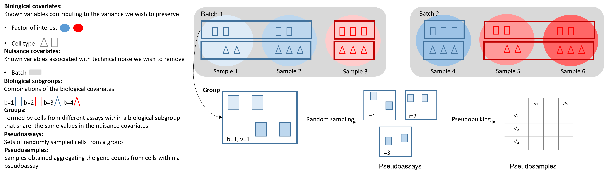

# ISCB-LATAM Conference - RUVIII PBPS implementation

PBPS is a method developed to use RUVIII in pseudobulk analyses of single cell RNA Sequencing data when no technical replicates are available (or not enough).

The core function `gen_PBPS()` uses the cells of different samples with similar biology and exposed to the same technical settings (nuisance covariates) to create new pseudobulk pseudosamples, to be used later as negative control samples in the RUVIII method.
 
 
<!-- -->

 