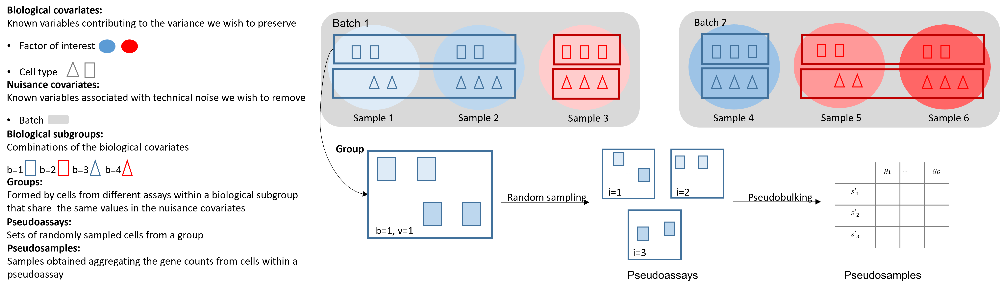

# ISCB-LATAM Conference - RUVIII PBPS implementation

## Pseudobulk RUV
RUV methods assume that the pseudobulk log-transformed matrix $log_2 (Y_t)_ {S \times G}$ from a particular cell type $t$ can be analysed with a linear regression model by a set of factors of interest, or biological covariates, $X_{S \times Q}$, and a set of unwanted factors ${W_t}_{S\times K}$, often unknown. $S$ is the number of samples with the cell type $t$, $G$ the number of genes, $Q$ the number of biological covariates, and $K$ the number of unwanted hidden factors. The model can be written as

$$E(log_2(Y_t)|W_t, X) = W_t\alpha_t + X\beta_t$$

To estimate $W_t$ and $\alpha_t$, we can, for instance, use RUVIII: An RUV method that relies on the existence of technical replicates that capture the unwanted variation.

## PBPS
PBPS is a method developed to use RUVIII in pseudobulk analyses of single cell RNA Sequencing data when no technical replicates are available (or not enough). It uses the cells of different samples with similar biology and exposed to the same technical settings (nuisance covariates) to create new pseudobulk pseudosamples.
 
<!-- -->

The pseudosamples are used as negative control samples in the RUVIII method and have been particularly useful in normalizing datasets.

## Directory structure

+ `R/`: Contains the scripts with the auxiliary functions and the differential expression simulations.
+ `Vignettes/`: Contains the vignettes about data wrangling, the PBPS function and the normalization comparisons between other RUV methods and the RUVIII PBPS method. 
+ `ISCB/`: Contains the Rmarkdown files and the graphs used in the vignettes.
+ `Data/`: Has the list of negative control genes used for the analyses.
