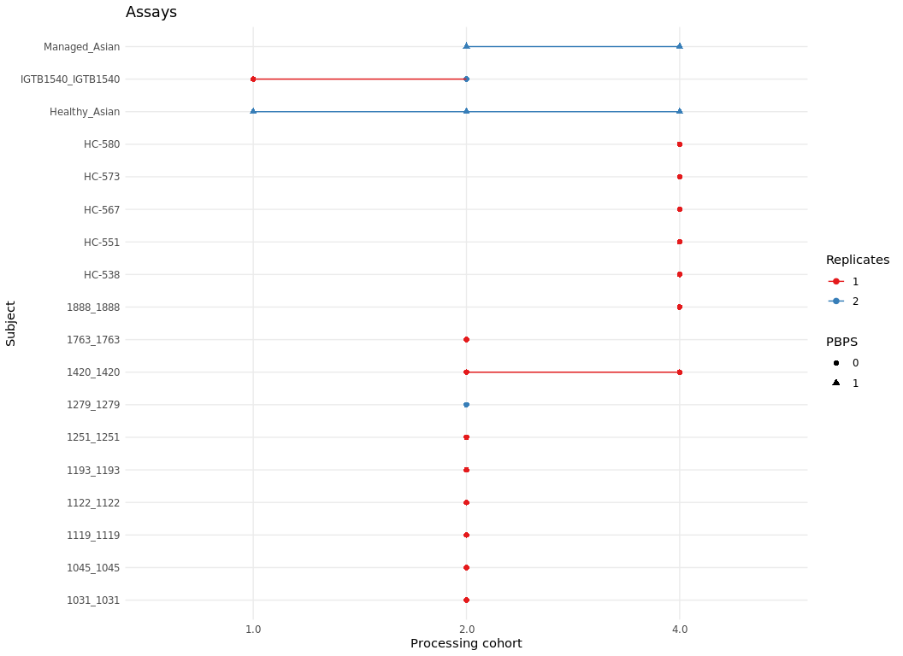

How to generate PBPS
================

``` r
knitr::opts_chunk$set( message = FALSE, warning = FALSE, fig.height=8, fig.width=11)

library(tidyverse)
library(BiocManager)
library(Seurat)
library(scater)
```

# Step by step

Start by reading the necessary preprocessed files. For more details,
refer to the Data Wrangling vignette.

``` r
ds <- readRDS("/domino/datasets/local/RUV/sclupusds3cor.rds")  # Seurat object with the single cell information, a cell id must be included in the metadata
PBC <- readRDS("/domino/datasets/local/RUV/pblupusds3.rds") # PSeudobulk object
```

To generate PBPS, provide the variable names for the biological and
nuisance covariates, and specify $n$, the number of pseudoreplicates to
create from each group.

``` r
ctype <- 'cg_cov'# Cell type 
BioVar <- c('Status','cg_cov','pop_cov') # Bioligical variables, at least cell type and factor of interest
NVar <- 'Processing_Cohort' # Nuisance covariates
id_pb <- 'sample_cell' # Pseudobulk id
id_sub <- 'ind_cov' # Subject id (for RUVIII)
cell_id <- 'cell_id' # cell id
n=2 # Number of pseudoreplicates per group
```

The function first creates $b$ biological subgroups, with $v_b$ groups
each, and includes them in the metadata of the pseudobulk object.

``` r
groups_info <- group_by(PBC$samples,across(all_of(c(BioVar,NVar))))%>%
  summarise(nsample=n()) %>% mutate(bsg = paste(!!!syms(BioVar), sep = "_"),
         group=paste(bsg,!!!syms(NVar),sep='_'))

bsg.keep <- names(table(groups_info$bsg)[table(groups_info$bsg)>1]) # remove bsg with only 1 group

PBC$samples <- mutate(PBC$samples, bsg = paste(!!!syms(BioVar), sep = "_"),
                    group=paste(bsg,!!!syms(NVar),sep='_')) # add bsg and group info
```

The function assigns biological subgroups and groups to the cells in the
Seurat object, filtering out those that belong to subgroups with no
technical variability (i.e., those with only one group).

``` r
sc.ref <- ds@meta.data %>%mutate(bsg = paste(!!!syms(BioVar), sep = "_"),
                    group=paste(bsg,!!!syms(NVar),sep='_')) %>% filter(bsg %in% bsg.keep)
```

We use the `cellspbps()` function to sample with replacement, $\bar c_b$
cells from each $b_v$ group $n$ times, where $\bar c_b$ is the average
number of cells from the assays within the biological subgroup $b$, and
$n$ is the number of pseudoreplicates we want to create from each group
$b_v$. Each pool of cells is called a pseudoassay (pa).

``` r
cellspbps <- function (subsample, pb_id='sample_cell',cell_id='cell_id', seed = 1,n=1){
  
  
  # compute the average number of cells per biological group
  total_cell <- subsample %>% group_by(across(all_of(pb_id))) %>% summarise(ncell=n())
  subsample <- left_join(subsample,total_cell)
  avg_cell <- group_by(subsample,bsg)%>%summarise(avg_ncell=mean(ncell))
  avg_cell <- dplyr::select(subsample,group,bsg)%>% unique()%>% left_join(avg_cell,by='bsg')
  rownames(avg_cell) <- avg_cell$group
  
  # select the cells from each group
  groups <- split(subsample[,cell_id],subsample$group)
  avg_cell <- avg_cell[names(groups),]
  set.seed(seed)
  
  #sampling with replacement
  pseudo_samp <- replicate(n,list(mapply(function (x,y) 
    base::sample(x=x,size=round(y),replace=T),groups, avg_cell$avg_ncell, SIMPLIFY = F)))
  
  names(pseudo_samp) <- paste0('pa',1:n)
  pseudo_samp <- unlist(pseudo_samp,recursive=FALSE)
  
  return(pseudo_samp)
  
}

cells_to_pbps <- cellspbps(subsample = sc.ref, seed = 2, n = n)
```

Using the Seurat object and the cells sampled in the previous step, the
`pbps()` function aggregates the counts of each pseudoassay into a
pseudobulk pseudosample (PBPS).

``` r
pbps <- function(pseudo_samp,Gr, ds , cell_id='cell_id'){
  
  
  ds$orig.index <- ds@meta.data[[cell_id]] %in% pseudo_samp[[Gr]]
  Idents(object = ds) <- "orig.index"
  origgcounts <- GetAssayData(object = subset(x = ds, idents = TRUE), assay = "originalexp", slot = "counts")
  psscounts <- origgcounts[,pseudo_samp[[Gr]]]### cell names might be repeated, this does the trick
  pssamp <- rowSums(psscounts)
  return(pssamp)
}

pbpscounts <- sapply(names(cells_to_pbps),function(x)pbps(cells_to_pbps,Gr=x,ds=ds))
```

The metadata of the PBPS pseudobulk object is created.

``` r
pbps_info <- sapply(colnames(pbpscounts), function (x) regmatches(x, regexpr("\\.", x), invert = TRUE))
pa <- sapply(pbps_info,function (x) x[1])
pa_group <- sapply(pbps_info,function (x) x[2])


pbps_info <- tibble(!!id_pb:= colnames(pbpscounts), pa = pa, group = pa_group) %>%
  left_join(groups_info, by='group') %>% select(-nsample)

miss_var <- colnames(PBC$samples)[!colnames(PBC$samples) %in% colnames(pbps_info) ]
otherv <- sapply(miss_var,function(x) pbps_info[,x ]<- rep(NA,dim(pbps_info)[1]))
pbps_info <- cbind(pbps_info,otherv) %>% mutate(pbps=1)
```

And both pseudobulk objects are joined, and ready to use in the RUVIII
algorithm.

``` r
sifull <- mutate(PBC$samples,pbps=0, pa='orig') %>% rbind(pbps_info)

sifull$ind_cov <- as.character(sifull$ind_cov)


sifull[sifull$pbps==1,] <- sifull[sifull$pbps==1,] %>% mutate(!!id_sub:= paste(!!!syms(setdiff(BioVar, ctype)), sep = "_"))
fullcount <- cbind(PBC$counts,pbpscounts[rownames(PBC),])

PBPSC <- DGEList(counts = fullcount, samples = sifull)
```

# The function

The previous process is summarized in the `gen_PBPS()` function.

``` r
PBPSC <- gen_PBPS(ds=ds, PBC=PBC, ctype='cg_cov', BioVar=c('Status','cg_cov','pop_cov'), NVar='Processing_Cohort', id_pb='sample_cell', id_sub='ind_cov', cell_id='cell_id', n=2, Seed=2 )
```

# Results before RUVIII

## Samples and pseudosamples

<!-- -->

## B

<!-- -->

## NK

<!-- -->

## T4

<!-- -->

## T8

<!-- -->

## cDC

<!-- -->

## cM

<!-- -->

## ncM

<!-- -->

## pDC

<!-- -->
