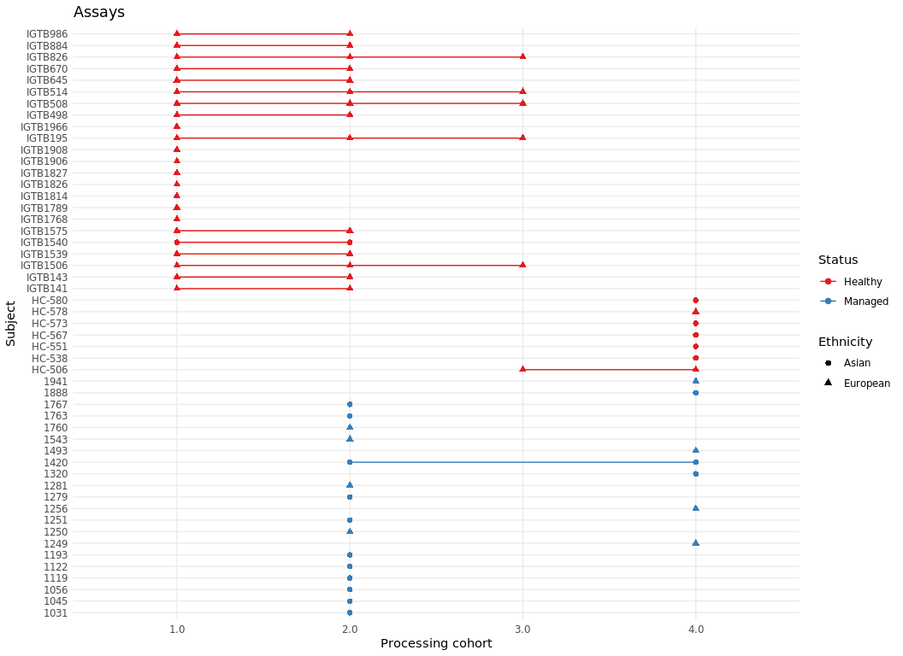
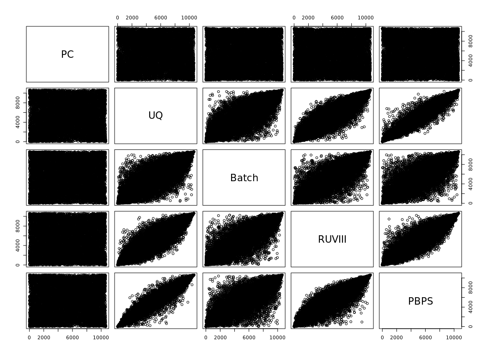
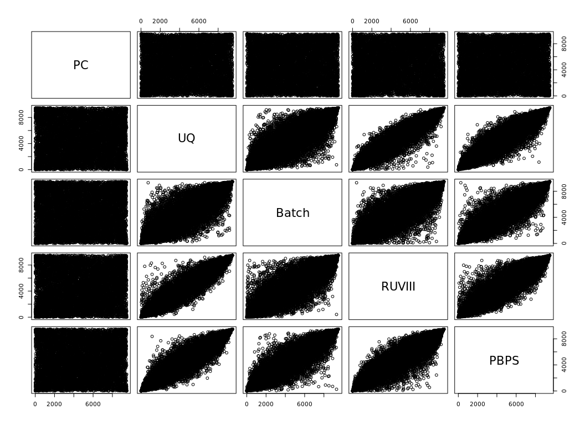
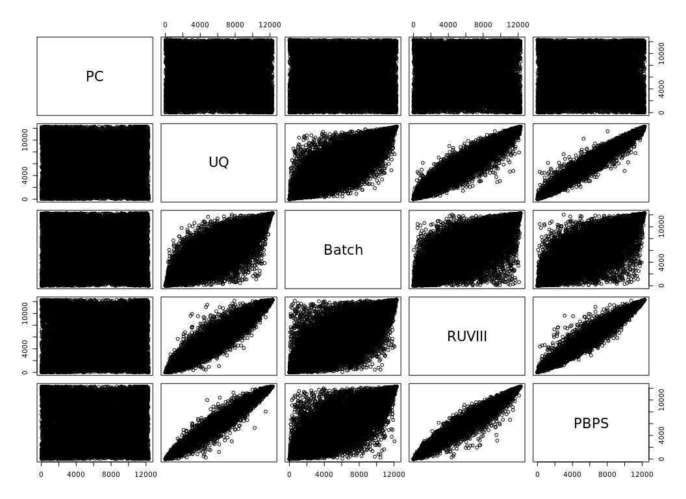
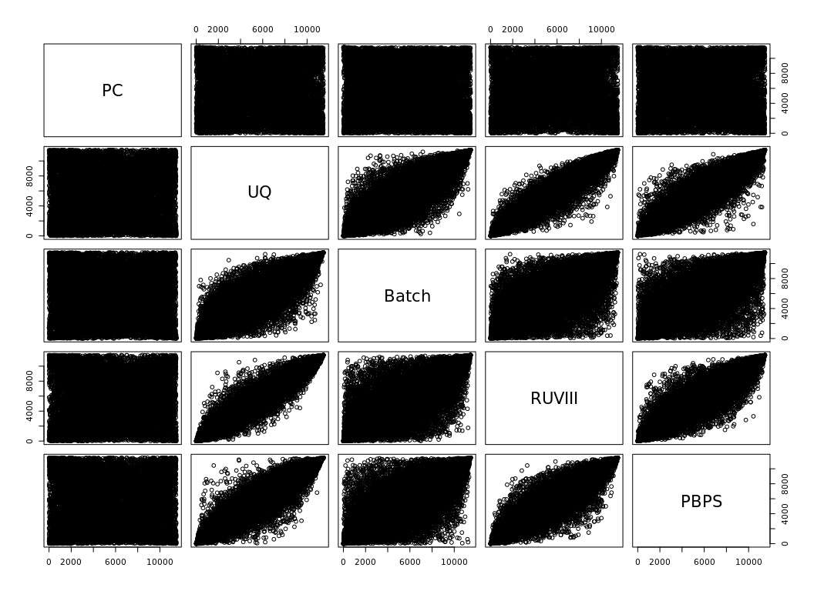
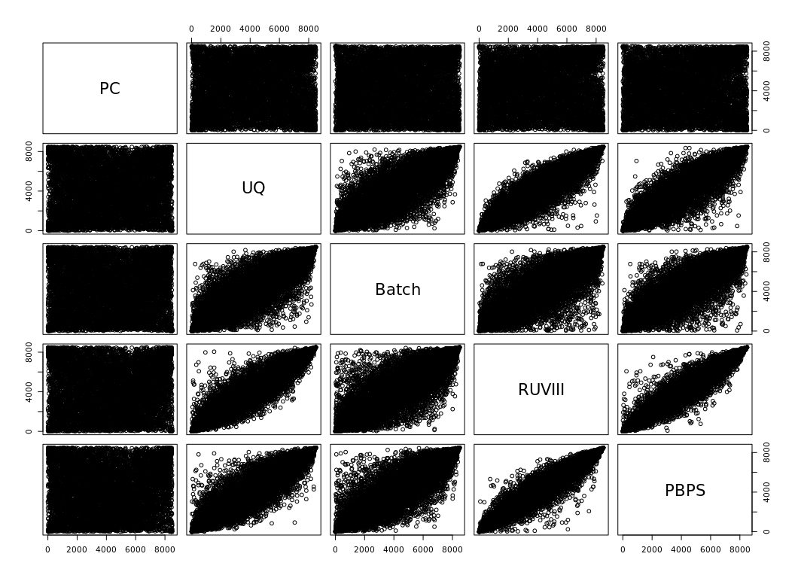
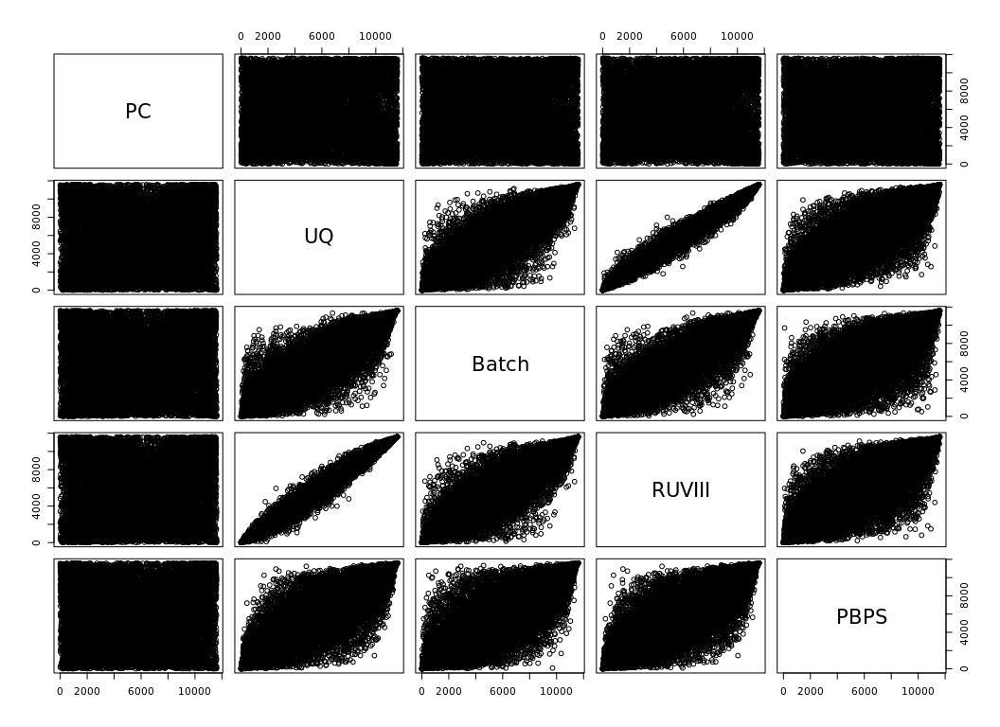
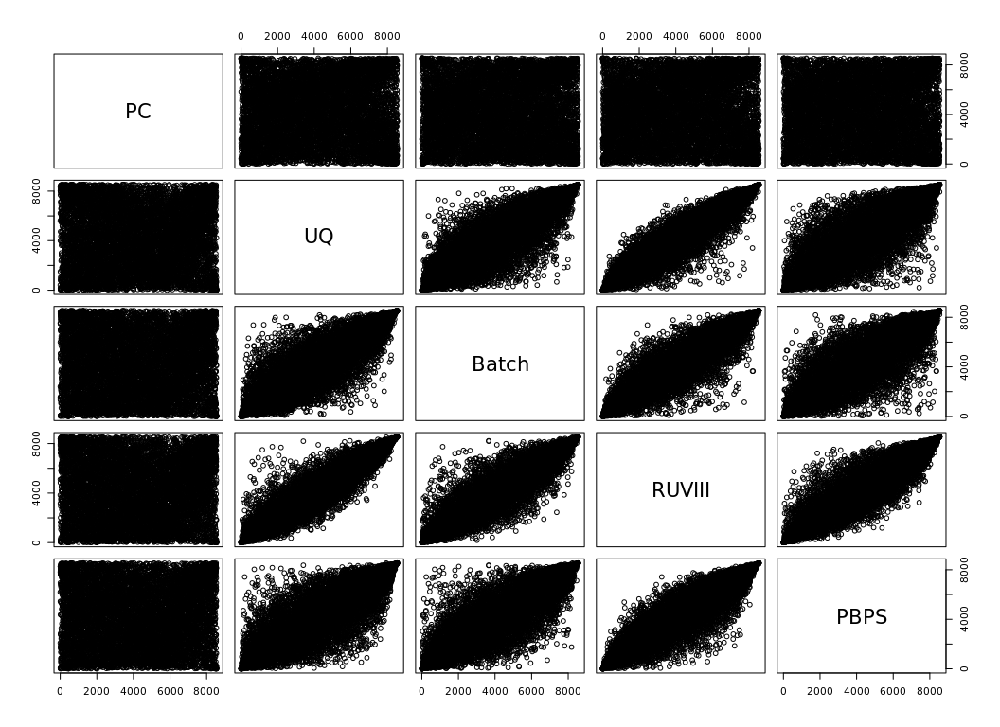
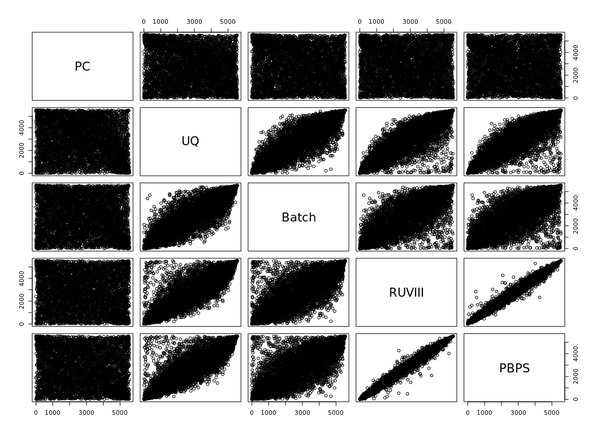

Study case
================

``` r
DiffGPCs <- readRDS("/domino/datasets/local/RUV/DiffGPC24.rds")

topallDPC <- lapply(DiffGPCs, function (x) dplyr::arrange(x,P.Value))
logFC_PC <- lapply(topallDPC, function(x) dplyr::select(x,logFC))

DiffPC.sig<- lapply(DiffGPCs, function (x) dplyr::filter(x,P.Value<0.01))
topDPC <- lapply(DiffPC.sig, function(x) arrange(x,P.Value) )
#logFC_PC <- lapply(topDPC, function(x) x$logFC)
```

``` r
hkGagnon <- read.csv(paste0(path,"/Genes_Gagnon.txt"), sep="")
hkGagnon <- unlist(hkGagnon)
filter.vst<-FindVariableFeatures(PBC,selection.method = 'vst')
high_varg <- which(filter.vst[hkGagnon,]$vst.variance.standardized>1.8)
hk.ind <- rownames(PBC) %in% hkGagnon[-high_varg]

gene.D <- data.frame(gene=rownames(PBC))
rownames(gene.D) <- gene.D$gene
celltypes <- levels(PBC$samples$cg_cov)
```

``` r
PBPSC <- readRDS( "/domino/datasets/local/RUV/pbps10rep_studycasemix.rds")


# Alternatively: 

# PBPSC <- gen_PBPS(ds=ds, PBC=PBC, ctype='cg_cov', BioVar=c('Status','cg_cov','pop_cov'), NVar='Processing_Cohort', id_pb='sample_cell', id_sub='ind_cov', cell_id='cell_id', n=10, Seed=2 )
# 
# write_rds(PBPSC, "/domino/datasets/local/RUV/pbps10rep_studycasemix.rds")
```

# Dataset

We have N = 85 assays from J = 51 subjects selected from the lupus
dataset, distributed as follows:

``` r
group_by(PBC$samples,Processing_Cohort,ind_cov,pop_cov,Age,Status) %>%
  summarise(count=n()) %>% ungroup()%>% 
  mutate(ind_cov=str_extract(as.character(ind_cov),"[^_]+$")) %>%
  ggplot(aes(y=ind_cov,x=Processing_Cohort, group=ind_cov, color=Status, shape = pop_cov)) +
  geom_point(size=2) + geom_line() + scale_colour_brewer(palette='Set1') +
  labs(y = "Subject", x= "Processing cohort", color = "Status", shape = "Ethnicity")+ theme_minimal()+
  ggtitle('Assays')
```

<!-- -->

``` r
#ggsave(paste0(path,'/20reps.png'),height = 5, width = 7)
```

The dataset has no technical replicates between the healthy controls of
processing cohorts 2 and 4. There is also a confounding effect between
processing cohorts and the disease status, observed for instance in the
PCA of the CD4 T-cells

## Metrics functions

``` r
split.ct <- function(PBC,ct){
  
  y.ct <- PBC[rowSums(PBC$counts >= 5) >= 5,PBC$samples$cg_cov==ct]
  pmin <- find_p(y.ct)
  y.ct <- calcNormFactors(y.ct, method="upperquartile", p=pmin)
  
return(y.ct)
}

PCAplot <- function (pca,y,avg_sw2=F,avg_swp=F){
  
  if(isTRUE(avg_sw2|avg_swp)){
   labelgg <- paste0(c('2 PCs: ','10 PCs: '), c(avg_sw2,avg_swp)) 
  }else{
   labelgg <- ""
  }
  
  if(is.null(rownames(pca))){
    rownames(pca)<- y$samples$sample_cell
  }
  
  pos_x <- min(pca[,1])
  pos_y <- min(pca[,2]) 
  ppca <- data.frame(pca) %>%
  tibble::rownames_to_column("sample_cell") %>% # Add the metadata into this data frame; match by sample IDs
  dplyr::inner_join(y$samples, by = "sample_cell") %>%
  ggplot(aes(x = PC1,y = PC2,color= Processing_Cohort)) + geom_point(aes(shape=Status),size=3) + 
    #ggtitle("Logcpm plot") +
    labs(color = "Processing cohort", shape = "Status") + 
    theme_minimal()+ theme(legend.position = "bottom") + scale_color_brewer(palette='Set1')+
    annotate("text", x = c(pos_x+3,pos_x+3), y = c(pos_y+3, pos_y), label = labelgg, size=3, fontface="bold")
    
  return(ppca)
  
}

Silplot <- function (sil){
  
  fviz_silhouette(sil)+ scale_fill_brewer(palette = 'Set1') + 
    scale_color_brewer(palette = 'Set1') + theme_minimal() +
    theme(axis.text.x=element_blank(),legend.position = "bottom") +
    labs(fill="Processing Cohort",color="Processing Cohort")
}

RLEplot <-function(names, logy, samples){
   
  median <- apply(logy, 1, median)
  samples <- as.data.frame(samples)
  
  rle <- apply(logy, 2, function(x) x - median)
  dataplot <- as.data.frame(rle) %>% 
    pivot_longer(everything(),names_to = 'sample_cell') %>% 
    left_join(samples, by='sample_cell')
  
  dataplot$sample_cell <- fct_relevel(dataplot$sample_cell,names)
  
  ggplot(dataplot,aes(x=sample_cell, y=value,colour = Processing_Cohort )) +
    geom_boxplot(outlier.shape = NA) + ylim(-2,2) + scale_color_brewer(palette='Set1') + ggtitle("RLE plot") +
     geom_hline(yintercept=0, linetype='dashed') + labs(y="Relative log expression", color='Processing cohort')+
    theme_minimal()+ theme( legend.position = 'bottom',strip.text =element_blank(),
                            axis.title.x = element_blank(),
                            axis.text.x = element_blank(),
                            axis.ticks.x = element_blank())

}

histpvals <- function(y){
  
  design <- model.matrix(~ y$samples$Status ) 
  colnames(design) <- c('Intercept','Managed')
  v <- voom(y, design, plot=F) 
  vfit <- lmFit(v, design)
  efit <- eBayes(vfit)
  pvalsUQ <- topTable(efit, coef=2, number=dim(y)[1], adjust="BH")
  
  p <- ggplot(pvalsUQ, aes(x=P.Value)) + geom_histogram(bins=15) + scale_color_brewer(palette='Set1') + ggtitle("P-values histogram") + theme_minimal()
  
  return(list(pvals=pvalsUQ,hist =p))
  
}

logfcs <- function(DPC, pvals,names=c('disease status','UQ')){
  
  colnames(DPC) <- paste0(colnames(DPC),'_pc')
  
  datatoplot <- inner_join(rownames_to_column(DPC,'gene'),rownames_to_column(pvals,'gene'), by='gene')
  
  cormethods <- paste0('Cor: ',round(cor(datatoplot$logFC_pc,datatoplot$logFC),2))
  
  pos_x <- min(datatoplot$logFC_pc)
  pos_y <- min(datatoplot$logFC)
  
  ggplot(datatoplot, aes(x=logFC_pc, y=logFC))+geom_point()+ #scale_color_continuous(type = "viridis")+
    labs(x =paste0("LogFC ",names[1]), y = paste0("LogFC ",names[2])) + 
    theme_minimal()+ theme(legend.position = "bottom") + ggtitle('Log Fold Changes')+
    annotate("label", x = pos_x+1, y = pos_y, label = cormethods, size=3, fontface="bold")

  
  
}
```

## Unwanted variation in the data

### Code

``` r
ys.ct <- lapply(celltypes,split.ct,PBC=PBC)

logys.ct <- lapply(ys.ct,edgeR::cpm,log=T)
  
pcas <- lapply(logys.ct, calculatePCA, ncomponents=10)

pcos <- lapply(ys.ct, function (x) as.integer(x$samples$Processing_Cohort))
# pcos <- lapply(pcos, function (x) {x[x==3]<-4; x})
sil2s <- mapply(silhouette,x=pcos,dist=lapply(pcas,function(x) dist(x[,1:2],"euclidean") ), SIMPLIFY = F)
silps <- mapply(silhouette,x=pcos,dist=lapply(pcas,dist, "manhattan") ,SIMPLIFY = F)

avgs_sw2 <- lapply(sil2s, function (x) round(mean(x[,3]),2))
avgs_swp <- lapply(silps, function (x) round(mean(x[,3]),2))
  
ordnames <- lapply(ys.ct, function (x) arrange(x$samples,Processing_Cohort)$'sample_cell') 

Silplots <- lapply(silps,Silplot)

PCAplots <- mapply(PCAplot, pca= pcas, y=ys.ct, SIMPLIFY = F)

RLEplots <- mapply(RLEplot, names= ordnames, logy=logys.ct,samples=map(ys.ct, "samples"), SIMPLIFY = F)
```

``` r
for (i in 1:length(celltypes)){
  
  cat(knitr::knit_expand(text=paste0('\n### ',celltypes[i], ' {-}\n')))
  
  plots <- list(Silplots[[i]], PCAplots[[i]], RLEplots[[i]])
 
  print(ggpubr::ggarrange(plotlist=plots,nrow=1,ncol=3, common.legend = T, legend="bottom"))

  cat(knitr::knit_expand(text=paste0("\n\n")))

}
```

### B

<!-- -->

### NK

<!-- -->

### T4

<!-- -->

### T8

<!-- -->

### cDC

<!-- -->

### cM

<!-- -->

### ncM

<!-- -->

### pDC

<!-- -->

## Naive DEA

### Code

``` r
Hists <- lapply(ys.ct,histpvals)

LFCplots <- mapply(function (x,y) logfcs(DPC=x, pvals=y$pvals,names=c('PC','UQ')),x=topallDPC, y=Hists, SIMPLIFY=F)

trueLFC <- mapply(function (x,y) dplyr::select(x$pvals, logFC)[rownames(y),]-y, x=Hists, y=logFC_PC, SIMPLIFY = F)
```

``` r
for (i in 1:length(celltypes)){
  
  cat(knitr::knit_expand(text=paste0('\n### ',celltypes[i], ' {-}\n')))
  
  plots <- list( Hists[[i]]$hist,LFCplots[[i]])
 
  print(ggpubr::ggarrange(plotlist=plots,nrow=1,ncol=2))

  cat(knitr::knit_expand(text=paste0("\n\n")))

}
```

### B

<!-- -->

### NK

<!-- -->

### T4

<!-- -->

### T8

<!-- -->

### cDC

<!-- -->

### cM

<!-- -->

### ncM

<!-- -->

### pDC

<!-- -->

## 

# Analysis

We will evaluate the PCA plots and average silhouette width (ASW) using
the processing cohort as label, from the normalised matrices returned
from the RUVIII and RUVIII PBPS methods, and the normalised matrix
obtained by subtracting the processing cohort effect.

Additionally, using another dataset with only healthy controls, we
identified 12334 DEG between processing cohort 2 and processing cohort
4.Using the log fold changes of said analysis we will compute the true
log fold changes for the Disease status; and compare the results with
the log fold changes from the models with the disease status and the
processing cohort covariate, the disease status and 2 hidden unwanted
factors using RUVIII, and the model with the disease status and with 2
hidden unwanted factors using RUVIII PBPS.

## Including the processing cohort effect

### Code

``` r
normpc <- function(y){
  logy <- edgeR::cpm(y,log=T)
  design <- model.matrix(~ y$samples$Status + y$samples$Processing_Cohort ) 
  #colnames(design) <- c('(Intercept)','tr',paste0('Proc',  c(2,4)))
  v <- voom(y, design, plot=F) 
  vfit <- lmFit(v, design)
  alpha <- vfit$coefficients[,3:4] # same coefficients as efit and returned by toptable
  newY <- logy - t(design[,c(3:4)]%*%t(alpha))
  return(newY)
}

histpc <- function(y){
  logy <- edgeR::cpm(y,log=T)
  design <- model.matrix(~ y$samples$Status + y$samples$Processing_Cohort ) 
  # colnames(design) <- c('(Intercept)','tr',paste0('Proc', c(2,4)))
  v <- voom(y, design, plot=F) 
  vfit <- lmFit(v, design)
  efit <- eBayes(vfit)
  pvalspc <- topTable(efit, coef=2, number=dim(y)[1], adjust="BH")
  
  p <- ggplot(pvalspc, aes(x=P.Value)) + geom_histogram(bins=15) + scale_color_brewer(palette='Set1') + ggtitle("P-values histogram") + theme_minimal()
 
  return(list(pvals=pvalspc,hist =p))
  
  
  
}


normpcs.ct <- lapply(ys.ct,normpc)
pcas <- lapply(normpcs.ct, calculatePCA, ncomponents=10)
pcos <- lapply(ys.ct, function (x) as.integer(x$samples$Processing_Cohort))
# pcos <- lapply(pcos, function (x) {x[x==3]<-4; x})


sil2s <- mapply(silhouette,x=pcos,dist=lapply(pcas,function(x) dist(x[,1:2],"euclidean") ), SIMPLIFY = F)
silps <- mapply(silhouette,x=pcos,dist=lapply(pcas,dist, "manhattan") ,SIMPLIFY = F)

avgs_sw2 <- lapply(sil2s, function (x) round(mean(x[,3]),2))
avgs_swp <- lapply(silps, function (x) round(mean(x[,3]),2))
  
ordnames <- lapply(ys.ct, function (x) arrange(x$samples,Processing_Cohort)$'sample_cell') 

Silplots <- lapply(silps,Silplot)

PCAplots <- mapply(PCAplot, pca= pcas, y=ys.ct, SIMPLIFY = F)

RLEplots <- mapply(RLEplot, names= ordnames, logy=normpcs.ct, samples=map(ys.ct, "samples"), SIMPLIFY = F)

HistsB <- lapply(ys.ct,histpc)
  
LFCplots <- mapply(function (x,y) logfcs(DPC=x, pvals=y$pvals,names=c('True','Batch')),x=trueLFC, y=HistsB, SIMPLIFY=F)
```

### Normalisation

``` r
for (i in 1:length(celltypes)){
  
  cat(knitr::knit_expand(text=paste0('\n#### ',celltypes[i], ' {-}\n')))
  
  plots <- list(Silplots[[i]], PCAplots[[i]], RLEplots[[i]])
 
  print(ggpubr::ggarrange(plotlist=plots,nrow=1,ncol=3, common.legend = T, legend="bottom"))

  cat(knitr::knit_expand(text=paste0("\n\n")))

}
```

#### B

<!-- -->

#### NK

<!-- -->

#### T4

<!-- -->

#### T8

<!-- -->

#### cDC

<!-- -->

#### cM

<!-- -->

#### ncM

<!-- -->

#### pDC

<!-- -->

### DEA

``` r
for (i in 1:length(celltypes)){
  
  cat(knitr::knit_expand(text=paste0('\n#### ',celltypes[i], ' {-}\n')))
  
  plots <- list( HistsB[[i]]$hist,LFCplots[[i]])
 
  print(ggpubr::ggarrange(plotlist=plots,nrow=1,ncol=2))

  cat(knitr::knit_expand(text=paste0("\n\n")))

}
```

#### B

<!-- -->

#### NK

<!-- -->

#### T4

<!-- -->

#### T8

<!-- -->

#### cDC

<!-- -->

#### cM

<!-- -->

#### ncM

<!-- -->

#### pDC

<!-- -->

## RUVIII

### Code

``` r
histT <- function (y,w,samples){
  k <- ncol(w)
  design <- model.matrix(~ samples$Status + w ) 
  colnames(design) <- c('Intercept','tr', paste0("W",1:k))
  v <- voom(y, design, plot=F) 
  vfit <- lmFit(v, design)
  efit <- eBayes(vfit)
  pvalsT <- topTable(efit, coef=2, number=dim(y)[1], adjust="BH")
  
  p <- ggplot(pvalsT, aes(x=P.Value)) + geom_histogram(bins=15) + scale_color_brewer(palette='Set1') + ggtitle("P-values histogram") + theme_minimal()
  
  return(list(pvals=pvalsT, hist=p))
  
  
}

k=3
  
Mcts.ct <- lapply (ys.ct, function(x){
  Mct <- replicate.matrix(x$samples$ind_cov)
  rownames(Mct) <- x$samples$ind_cov
  Mct
})

ruv3T2 <- mapply(RUVIIIW, Y = lapply(logys.ct,t), M=Mcts.ct , ctl =  lapply(ys.ct, function (x) rownames(x) %in% hkGagnon[-high_varg]), k= as.list(rep(k,length(celltypes))), return.info=as.list(rep(T,length(celltypes))), SIMPLIFY=F)

normT2 <- lapply(ruv3T2,function (x) t(x$newY))

pcas <- lapply(normT2, calculatePCA, ncomponents=10)

sil2s <- mapply(silhouette,x=pcos,dist=lapply(pcas,function(x) dist(x[,1:2],"euclidean") ), SIMPLIFY = F)
silps <- mapply(silhouette,x=pcos,dist=lapply(pcas,dist, "manhattan") ,SIMPLIFY = F)

avgs_sw2 <- lapply(sil2s, function (x) round(mean(x[,3]),2))
avgs_swp <- lapply(silps, function (x) round(mean(x[,3]),2))

ordnames <- lapply(ys.ct, function (x) arrange(x$samples,Processing_Cohort)$'sample_cell') 

SilplotsT23 <- lapply(silps,Silplot)

PCAplotsT23 <- mapply(PCAplot, pca= pcas, y=ys.ct, SIMPLIFY = F)

RLEplotsT23 <- mapply(RLEplot, names= ordnames, logy=normT2,samples= map(ys.ct,'samples'), SIMPLIFY = F)

HistsT23 <- mapply(histT,y=ys.ct,w=map(ruv3T2,"W"),map(ys.ct,'samples'),SIMPLIFY = F)
  
LFCplots <- mapply(function (x,y) logfcs(DPC=x, pvals=y$pvals,names=c('True','RUVIII')),x=trueLFC, y=HistsT23, SIMPLIFY=F)
```

### Normalisation

``` r
for (i in 1:length(celltypes)){
  
  cat(knitr::knit_expand(text=paste0('\n#### ',celltypes[i], ' {-}\n')))
  
  plots <- list(SilplotsT23[[i]], PCAplotsT23[[i]], RLEplotsT23[[i]])
 
  print(ggpubr::ggarrange(plotlist=plots,nrow=1,ncol=3, common.legend = T, legend="bottom"))

  cat(knitr::knit_expand(text=paste0("\n\n")))

}
```

#### B

<!-- -->

#### NK

<!-- -->

#### T4

<!-- -->

#### T8

<!-- -->

#### cDC

<!-- -->

#### cM

<!-- -->

#### ncM

<!-- -->

#### pDC

<!-- -->

### DEA

``` r
for (i in 1:length(celltypes)){
  
  cat(knitr::knit_expand(text=paste0('\n#### ',celltypes[i], ' {-}\n')))
  
  plots <- list( HistsT23[[i]]$hist,LFCplots[[i]])
 
  print(ggpubr::ggarrange(plotlist=plots,nrow=1,ncol=2))

  cat(knitr::knit_expand(text=paste0("\n\n")))

}
```

#### B

<!-- -->

#### NK

<!-- -->

#### T4

<!-- -->

#### T8

<!-- -->

#### cDC

<!-- -->

#### cM

<!-- -->

#### ncM

<!-- -->

#### pDC

<!-- -->

## RUVIII with pseudobulk pseudosamples

### Code

``` r
psys.ct <- lapply(celltypes,split.ct,PBC=PBPSC)
pslogys.ct <- lapply(psys.ct,edgeR::cpm,log=T)
psMcts.ct <- lapply (psys.ct, function(x){
  Mct <- replicate.matrix(x$samples$ind_cov)
  rownames(Mct) <- x$samples$ind_cov
  Mct
})

ruv3ps <- mapply(RUVIIIW, Y = lapply(pslogys.ct,t), M=psMcts.ct , ctl =  lapply(psys.ct, function (x) rownames(x) %in% hkGagnon[-high_varg]), k= as.list(rep(k,length(celltypes))), return.info=as.list(rep(T,length(celltypes))), SIMPLIFY=F)


normpsfull <- lapply(ruv3ps, function (x) t(x$newY))

pcas <- lapply(normpsfull, calculatePCA, ncomponents=10)
PCAplotspsfull <- mapply(PCAplot, pca= pcas, y=psys.ct, SIMPLIFY = F)

orig.s <- lapply(psys.ct, function(x) x$samples$sample_cell[x$samples$pbps==0])
normps <- mapply(function (x,y) t(x$newY[y,]), x=ruv3ps,y=orig.s, SIMPLIFY = F)

# mapply(function(x,y)sum(x!= y),x=lapply(normps,colnames),y=lapply(ys.ct,colnames)) #order is exactly the same as in sample with no pbps

pcas <- lapply(normps, calculatePCA, ncomponents=10)

sil2s <- mapply(silhouette,x=pcos,dist=lapply(pcas,function(x) dist(x[,1:2],"euclidean") ), SIMPLIFY = F)
silps <- mapply(silhouette,x=pcos,dist=lapply(pcas,dist, "manhattan") ,SIMPLIFY = F)

avgs_sw2 <- lapply(sil2s, function (x) round(mean(x[,3]),2))
avgs_swp <- lapply(silps, function (x) round(mean(x[,3]),2))

ordnames <- lapply(ys.ct, function (x) arrange(x$samples,Processing_Cohort)$'sample_cell') 

Silplotsps<- lapply(silps,Silplot)
```

    ##   cluster size ave.sil.width
    ## 1       1   23          0.34
    ## 2       2   42         -0.12
    ## 3       3    6          0.48
    ## 4       4   14         -0.22
    ##   cluster size ave.sil.width
    ## 1       1   23          0.45
    ## 2       2   42         -0.18
    ## 3       3    6          0.32
    ## 4       4   14         -0.20
    ##   cluster size ave.sil.width
    ## 1       1   23          0.19
    ## 2       2   42         -0.17
    ## 3       3    6          0.34
    ## 4       4   14         -0.07
    ##   cluster size ave.sil.width
    ## 1       1   23          0.21
    ## 2       2   42         -0.11
    ## 3       3    6          0.31
    ## 4       4   14         -0.09
    ##   cluster size ave.sil.width
    ## 1       1   23          0.31
    ## 2       2   42         -0.11
    ## 3       3    6          0.48
    ## 4       4   14         -0.25
    ##   cluster size ave.sil.width
    ## 1       1   23          0.22
    ## 2       2   42         -0.16
    ## 3       3    6          0.28
    ## 4       4   14          0.02
    ##   cluster size ave.sil.width
    ## 1       1   23          0.35
    ## 2       2   42         -0.14
    ## 3       3    6          0.33
    ## 4       4   14         -0.07
    ##   cluster size ave.sil.width
    ## 1       1   23          0.04
    ## 2       2   42         -0.17
    ## 3       3    6          0.21
    ## 4       4   14         -0.25

``` r
PCAplotsps <- mapply(PCAplot, pca= pcas, y=ys.ct, SIMPLIFY = F)

RLEplotsps <- mapply(RLEplot, names= ordnames, logy=normps,samples= map(ys.ct,'samples'), SIMPLIFY = F)

W<- mapply(function(x,y) x$W[y,], x=ruv3ps,y=orig.s, SIMPLIFY=F)

Histsps <- mapply(histT,y=ys.ct,w=W,map(ys.ct,'samples'),SIMPLIFY = F)
LFCplots <- mapply(function (x,y) logfcs(DPC=x, pvals=y$pvals,names=c('True','RUVIII PBPS')),x=trueLFC, y=Histsps, SIMPLIFY=F)
```

### Normalisation

``` r
for (i in 1:length(celltypes)){
  
  cat(knitr::knit_expand(text=paste0('\n#### ',celltypes[i], ' {-}\n')))
  
  plots <- list(PCAplotspsfull[[i]], Silplotsps[[i]], PCAplotsps[[i]], RLEplotsps[[i]])
 
  print(ggpubr::ggarrange(plotlist=plots,nrow=2,ncol=2, common.legend = T, legend="bottom"))

  cat(knitr::knit_expand(text=paste0("\n\n")))

}
```

#### B

<!-- -->

#### NK

<!-- -->

#### T4

<!-- -->

#### T8

<!-- -->

#### cDC

<!-- -->

#### cM

<!-- -->

#### ncM

<!-- -->

#### pDC

<!-- -->

### DEA

``` r
for (i in 1:length(celltypes)){
  
  cat(knitr::knit_expand(text=paste0('\n#### ',celltypes[i], ' {-}\n')))
  
  plots <- list( Histsps[[i]]$hist,LFCplots[[i]])
 
  print(ggpubr::ggarrange(plotlist=plots,nrow=1,ncol=2))

  cat(knitr::knit_expand(text=paste0("\n\n")))

}
```

#### B

<!-- -->

#### NK

<!-- -->

#### T4

<!-- -->

#### T8

<!-- -->

#### cDC

<!-- -->

#### cM

<!-- -->

#### ncM

<!-- -->

#### pDC

<!-- -->

## Common DEG

### Code

``` r
DEGs <- function(x){
  
  rownames(x$pvals)[x$pvals$adj.P.Val< 0.1]
}
    

DegsUQ <- lapply(Hists,DEGs)
DegsB <- lapply(HistsB ,DEGs)
Degs3 <- lapply(HistsT23,DEGs)
DegsPS <- lapply(Histsps,DEGs)

Degstoplot <- mapply(function(w,x,y,z) list(UQ=w,Batch=x,RUVIII=y, RUVIIIpbps=z), w=DegsUQ,x=DegsB,y=Degs3,z=DegsPS, SIMPLIFY = F)

upsetPlots <- lapply(Degstoplot[1:7], function(x) upset(fromList(x),order.by = "freq") )
```

``` r
for (i in 1:(length(celltypes)-1)){
  
  cat(knitr::knit_expand(text=paste0('\n### ',celltypes[i], ' {-}\n')))
 
  print(upsetPlots[[i]] )

  cat(knitr::knit_expand(text=paste0("\n\n")))

}
```

### B

<!-- -->

### NK

<!-- -->

### T4

<!-- -->

### T8

<!-- -->

### cDC

<!-- -->

### cM

<!-- -->

### ncM

<!-- -->

## Rankings

Differences in

``` r
for (i in 1:length(celltypes)){
  
  cat(knitr::knit_expand(text=paste0('\n### ',celltypes[i], ' {-}\n')))
  
 pcdgs <- rownames(DiffGPCs[[celltypes[i]]][rownames(DiffGPCs[[celltypes[i]]]) %in% rownames(Hists[[i]]$pvals), ])
UQ <- rownames(arrange(Hists[[i]]$pvals[rownames(Hists[[i]]$pvals) %in% pcdgs,],t))
Batch <- rownames(arrange(HistsB[[i]]$pvals[rownames(HistsB[[i]]$pvals) %in% pcdgs,],t))
RUVIII <- rownames(arrange(HistsT23[[i]]$pvals[rownames(HistsT23[[i]]$pvals) %in% pcdgs,],t))
PBPS <-  rownames(arrange(Histsps[[i]]$pvals[rownames(Histsps[[i]]$pvals) %in% pcdgs,],t))

orderDf <- data.frame(PC=pcdgs,
                      UQ,
                     Batch,
                     RUVIII,
                     PBPS)

allGenes <- unique(pcdgs)


rankDf <- data.frame(gene=allGenes,
                     PC= match( allGenes, pcdgs),
                     UQ=match( allGenes,orderDf$UQ,),
                     Batch=match( allGenes,orderDf$Batch,),
                     RUVIII=match( allGenes, orderDf$RUVIII),
                     PBPS=match( allGenes, orderDf$PBPS))

print(pairs(rankDf[,-1]))
  
cat(knitr::knit_expand(text=paste0("\n\n")))
   
}
```

    ## 
    ## ### B {-}

<!-- -->

    ## NULL
    ## 
    ## 
    ## 
    ## ### NK {-}

<!-- -->

    ## NULL
    ## 
    ## 
    ## 
    ## ### T4 {-}

<!-- -->

    ## NULL
    ## 
    ## 
    ## 
    ## ### T8 {-}

<!-- -->

    ## NULL
    ## 
    ## 
    ## 
    ## ### cDC {-}

<!-- -->

    ## NULL
    ## 
    ## 
    ## 
    ## ### cM {-}

<!-- -->

    ## NULL
    ## 
    ## 
    ## 
    ## ### ncM {-}

<!-- -->

    ## NULL
    ## 
    ## 
    ## 
    ## ### pDC {-}

<!-- -->

    ## NULL
